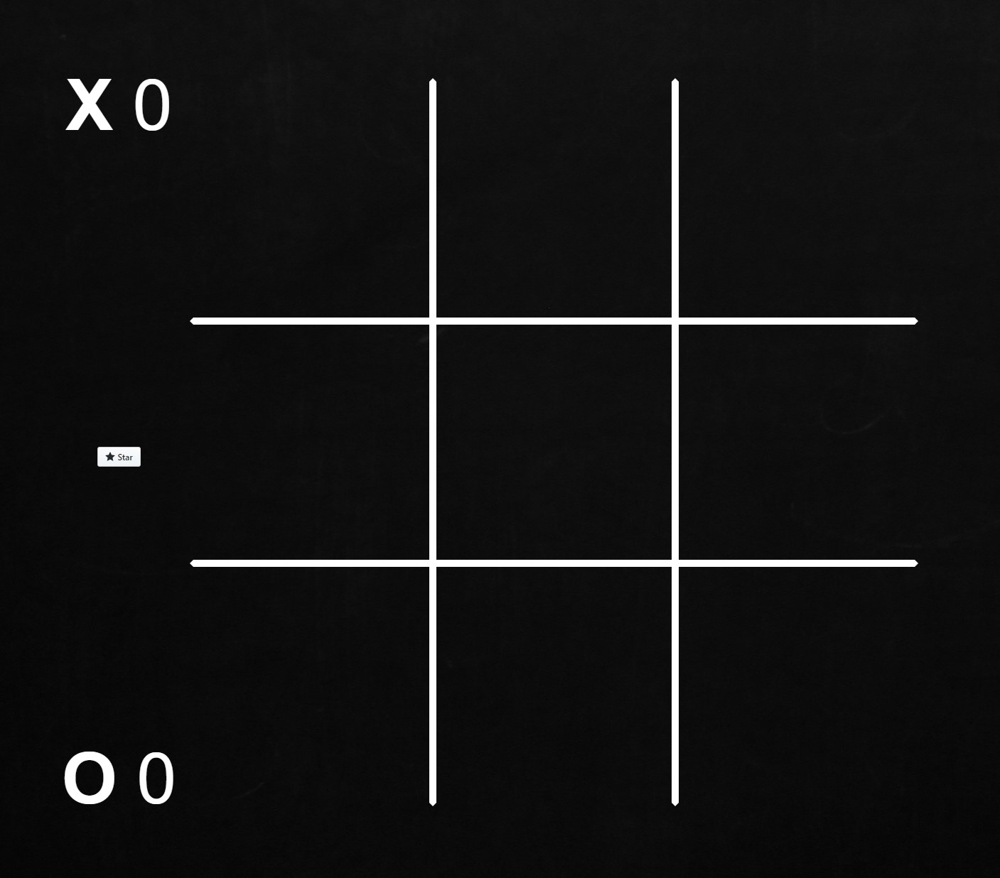

# Tic Tac Toe in VueJS
This is a simple tris game.

The project using VueJS.

The player can play against an AI that I have made personally.

It's not impossible to win but it's a bit hard :) Enjoy!

## For playing with it click this [link](https://frosty-albattani-20d20c.netlify.com/)!

---



---

## Project setup
```
npm install
```

### Compiles and hot-reloads for development
```
npm run serve
```

### Compiles and minifies for production
```
npm run build
```

### Lints and fixes files
```
npm run lint
```
